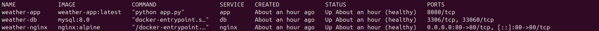
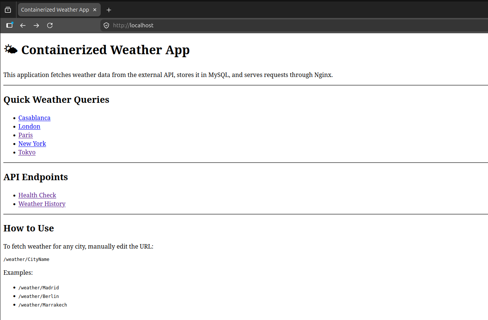
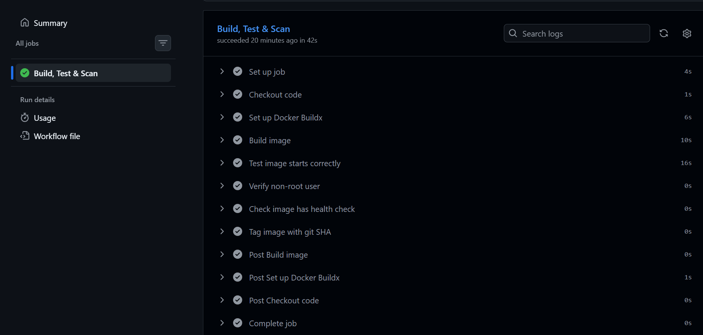

# 🌦️ Week 17 — Containerized Weather App

> **Cloud Engineering Roadmap** · Week 17 of 24

A production-style weather application built with **Flask**, **MySQL**, **Nginx**, and **Docker Compose**.

The application fetches live weather data from an external weather API, stores weather records in MySQL, serves requests through a Flask API, and sits behind an Nginx reverse proxy. The entire stack is containerized and includes health checks, a multi-stage Docker build, environment variable management, persistent storage, and a GitHub Actions CI pipeline.

---

# 🎯 Project Goals

This project focuses on learning modern containerization practices by taking a familiar Python application and transforming it into a production-style multi-container system.

Key objectives:

* Build a multi-stage Docker image
* Run services using Docker Compose
* Store persistent data using Docker volumes
* Serve traffic through Nginx
* Implement health checks
* Run containers as a non-root user
* Manage secrets with environment variables
* Build and validate images automatically using GitHub Actions

---

# 🏗️ Architecture

```text
                    ┌─────────────────┐
                    │     Browser     │
                    └────────┬────────┘
                             │
                             ▼
                    ┌─────────────────┐
                    │      Nginx      │
                    │ Reverse Proxy   │
                    └────────┬────────┘
                             │
                             ▼
                    ┌─────────────────┐
                    │     Flask API   │
                    │  Weather App    │
                    └────────┬────────┘
                             │
                             ▼
                    ┌─────────────────┐
                    │      MySQL      │
                    │ Persistent Data │
                    └─────────────────┘
```

---

# 📁 Project Structure

```text
containerized-weather-app/
├── app/
│   ├── app.py
│   ├── requirements.txt
│   └── templates/
│       └── index.html
│
├── migrations/
│   └── 001_init.sql
│
├── nginx/
│   └── default.conf
│
├── .github/
│   └── workflows/
│       └── docker.yml
│
├── Dockerfile
├── docker-compose.yml
├── docker-compose.prod.yml
├── .dockerignore
├── .env.example
├── README.md
```

---

# ⚙️ Technologies Used

* Docker
* Docker Compose
* Python 3.11
* Flask
* MySQL 8
* Nginx
* GitHub Actions
* OpenWeather API

---

# 🚀 Features

### Multi-Container Architecture

Three separate containers:

* Nginx
* Flask Application
* MySQL Database

Each service has a single responsibility and communicates through an isolated Docker network.

---

### Multi-Stage Docker Build

The application image is built using a dedicated builder stage and runtime stage.

Benefits:

* Smaller image size
* Faster deployments
* Cleaner runtime environment
* Reduced attack surface

---

### Reverse Proxy

Nginx acts as the public entry point.

Responsibilities:

* Receives incoming requests
* Forwards traffic to Flask
* Hides internal application details
* Provides a production-style architecture

---

### Health Checks

Application health is verified through:

```text
GET /health
```

Checks:

* Flask is running
* Database connectivity works

Health status is used by Docker Compose before dependent services start.

---

### Persistent Storage

A named Docker volume stores MySQL data.

Data survives:

```bash
docker compose down
```

Data is removed only when:

```bash
docker compose down -v
```

---

### Non-Root Containers

The Flask container runs as a dedicated application user rather than root.

Benefits:

* Improved security
* Reduced privilege exposure
* Production best practice

---

### CI Pipeline

GitHub Actions automatically:

* Builds the Docker image
* Verifies image startup
* Confirms non-root execution
* Checks health check configuration
* Validates image metadata

Runs automatically on:

* Push
* Pull Request

---

# 🌐 API Endpoints

## Health Check

```http
GET /health
```

Example:

```json
{
  "status": "healthy",
  "db": "connected"
}
```

---

## Fetch Weather

```http
GET /weather/<city>
```

Example:

```http
GET /weather/London
```

Example response:

```json
{
  "city": "London",
  "country": "GB",
  "temperature": 21.4,
  "humidity": 58,
  "description": "clear sky"
}
```

Each request is automatically stored in MySQL.

---

## Weather History

```http
GET /api/history
```

Returns the latest stored weather records.

---

## Homepage

```http
GET /
```

Simple UI providing quick access to weather queries and history.

---

# 🔧 Local Setup

## Clone Repository

```bash
git clone <https://github.com/Aboubakr2000Cloud/containerized-weather-app>
cd containerized-weather-app
```

---

## Create Environment File

```bash
cp .env.example .env
```

Fill in your values:

```env
DB_HOST=db
DB_PORT=3306
DB_NAME=weatherapp
DB_USER=appuser
DB_PASSWORD=your_password
DB_ROOT_PASSWORD=your_root_password
WEATHER_API_KEY=your_api_key
```

---

## Build and Start

```bash
docker compose up -d --build
```

---

## Verify Services

```bash
docker compose ps
```

Expected:

```text
weather-db      healthy
weather-app     healthy
weather-nginx   healthy
```



---

# 🧪 Testing
Web Page:



Health Check:

```bash
curl http://localhost/health
```


Fetch Weather:

```bash
curl http://localhost/weather/London
```


View History:

```bash
curl http://localhost/api/history
```


GitHub Actions Process:



---

# 📸 Screenshots

Suggested screenshots:

### Application Homepage

`screenshots/homepage.png`

### Weather Query Example

`screenshots/weather-query.png`

### API History Output

`screenshots/history.png`

### Docker Compose Services

`screenshots/docker-compose-ps.png`

### GitHub Actions Success

`screenshots/github-actions-success.png`

---

# 📚 Key Concepts Learned

* Containerization
* Multi-stage Docker builds
* Docker networking
* Docker volumes
* Health checks
* Reverse proxies
* Environment variable management
* CI/CD fundamentals
* Service dependency management
* Production-oriented container design

---

# 🏁 Outcome

This project transformed a simple weather application into a production-style containerized service using Docker best practices. The resulting image is lightweight, secure, health-aware, reproducible, and ready for deployment to AWS ECS in the next stage of the roadmap.

